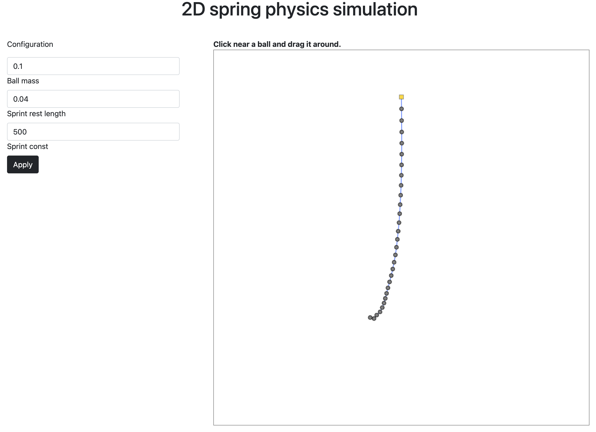

Physics 2D simulation
=====================
This is my first try of Scala JS.\
Project simulates 2D Physics of balls linked with a spring in an Earth gravity environment. 
Parameters can be changed from UI



Run steps
---------

```bash
npm install
sbt fastLinkJS
```
Open `index.html`